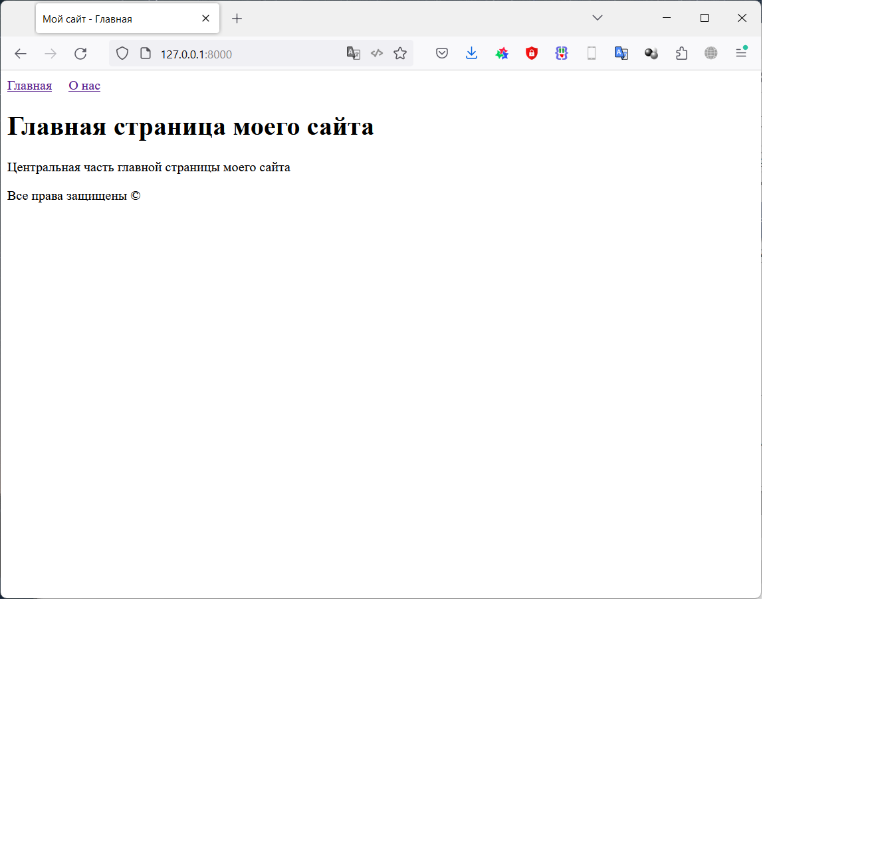
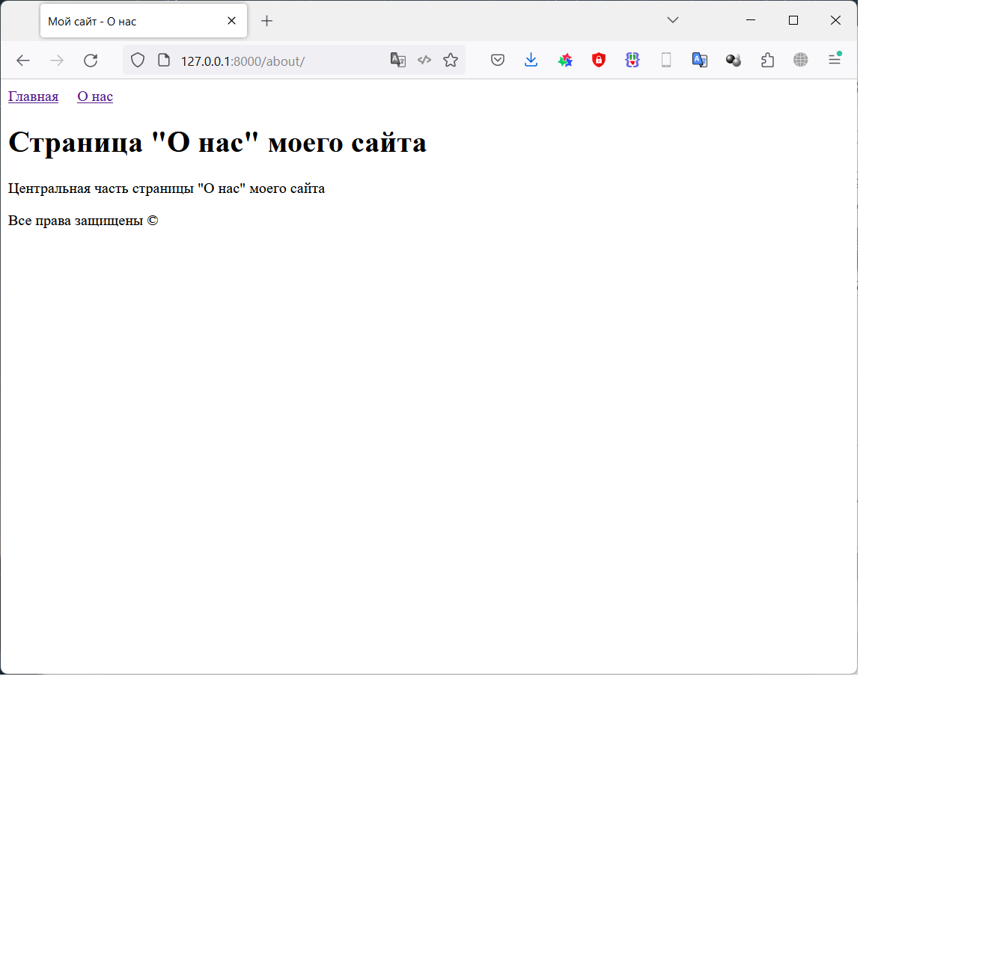

# Фреймворк Django (семинары)
## Урок 1. Первое Знакомство с Django

### Задание 1
Создайте пару представлений в вашем первом приложении:
- главная
- о себе.

Внутри каждого представления должна быть переменная html - многострочный текст с HTML-вёрсткой и данными о вашем первом Django-сайте и о вас.
- Сохраняйте в логи данные о посещении страниц.

### Решение
Устанавливаем Django:

    pip install django

Создаем проект для работы:

    django-admin startproject Django_dz1

Переходим в папку проекта:

    cd .\Django_dz1\

Создаем новое приложение в проекте:

    python manage.py startapp myapp

Запускаем сервер проекта:

    python manage.py runserver

Редактируем файлы:

- [Django_dz1/Django_dz1/Django_dz1/settings.py](/Django_dz1/Django_dz1/settings.py)
- [Django_dz1/Django_dz1/Django_dz1/urls.py](/Django_dz1/Django_dz1/urls.py)
- [Django_dz1/Django_dz1/myapp/urls.py](/Django_dz1/Django_dz1/urls.py)
- [Django_dz1/Django_dz1/myapp/views.py](/Django_dz1/myapp/views.py)
 
Файл с журналом работы:
- [logs/django.log](/Django_dz1/logs/django.log) 

## Результат работы:

Главная страница проекта:

Страница "О нас" проекта:

